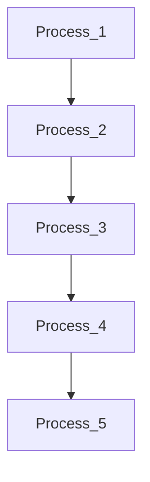
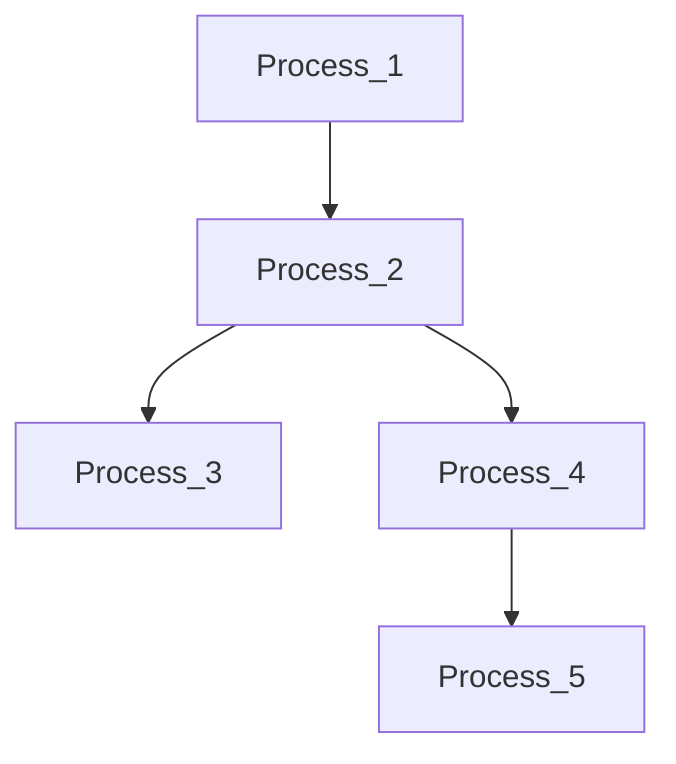

# How To a Create Pipeline
Pipeline are saved as `JSON`. You can view an example of a pipeline at the end of this file. The only required field is `Graph`. This field contains a subfield `Nodes` (which is required) and a subfield `Edges` which is optionnal.

## `Nodes` field
Each node is a process. You can find a template for each process [here](./json_templates.md).

## `Edges` field
The `Edges` field is optionnal. If this field is missing, each process will be connected to the next one. This is the simplest graph possible.



If this field is present, then it must contains the `start` and `end` indexes for each edges. The indexes correspond to the position of the process in the pipeline.



### Example of a pipeline
```json
{
  "Graph": {
    "Nodes": [
      {
        "Name": "process_notch",
        "Parameters": {
            "sensortypes": "MEG, EEG",
            "freqlist": [
              60,
              120,
              180
            ],
            "cutoffW": 1,
            "useold": 0,
            "display": []
          }
      },
      {
        "Name": "process_bandpass",
        "Parameters": {
            "sensortypes": "MEG, EEG",
            "label1": [],
            "highpass": 4,
            "lowpass": 30,
            "tranband": 0,
            "attenuation": "strict",
            "ver": "2019",
            "mirror": 0,
            "display": []
          }
      },
      {
        "Name": "process_eegref",
        "Parameters": {
            "title": [],
            "eegref": "AVERAGE",
            "sensortypes": "EEG"
          }
      }
    ],
    "Edges": [
      {
        "EndNodes": [
          1,
          2
        ]
      },
      {
        "EndNodes": [
          1,
          3
        ]
      }
    ]
  }
}
```