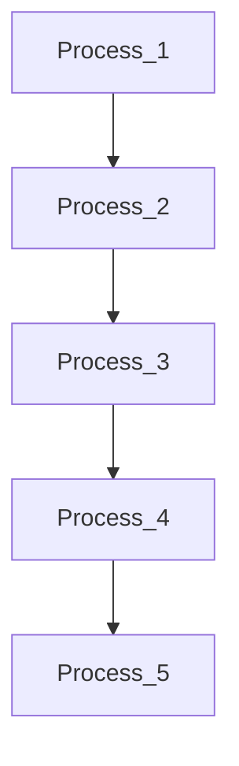
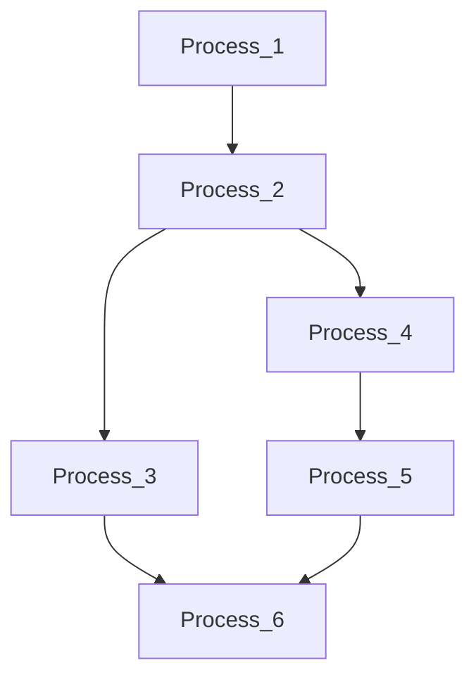

# How To a Create Pipeline

An [example of a pipeline](./example/pipeline_eeg_test.json) can be used as a starting point (before adding or removing processes). A [list of process](./process_documentation.md) and a [template for each process](./process_json_templates.md) is avaible on this repo.

Pipeline are saved as `JSON`. The only required field is `Graph`. This field contains a subfield `Nodes` (which is required) and a subfield `Edges` (which is optionnal).

## `Nodes` field
Each node is a process that has a field `Name` and a field `Parameters`. You can find a template for each process [here](./process_json_templates.md).

## `Edges` field
The `Edges` field is optionnal. If this field is missing, each process will be connected to the next one. This is the simplest graph possible.

If this field is present, then it must contains the `start` and `end` indexes for each edges. The indexes correspond to the position of the process in the pipeline. When adding the edges manually, you can create more complex graph. **This type of graph has not been fully implemented yet.**

